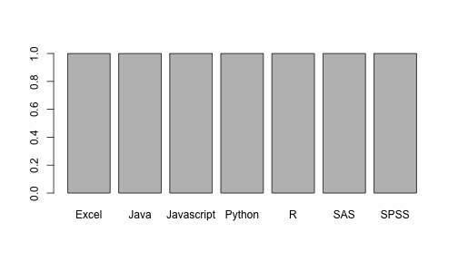

# An example
## For our workshop

We learned

+ how to enter data
+ how to aggregate

1. how to plot
2. using
  + ggplot
  + plot
  

First we will find out which software packages/systems we use. 

--------------------------
 ID   var2   var3   var4  
---- ------ ------ -------
 1   Python  SQL          

 2    SAS   Excel    SQL  

 3   Excel   SQL          

 4     R     SAS          

 5   Python  SQL   Tableau

 6   Excel                

 7   Excel   SPSS         

 8   Stata                

 9   Stata   SAS    Excel 

 10  Excel                
--------------------------

### So which software is the most popular? 

 

-------
This report was generated with [R](http://www.r-project.org/) (3.0.1) and [pander](https://github.com/rapporter/pander) (0.3.7) on x86_64-apple-darwin10.8.0 platform.