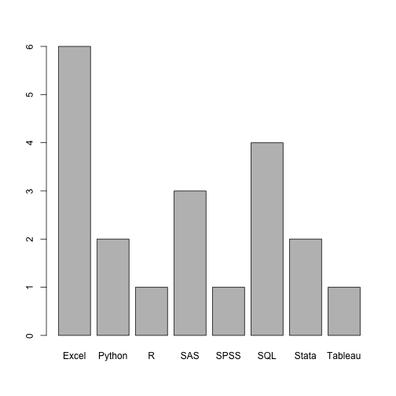
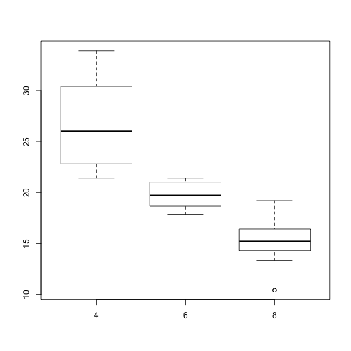
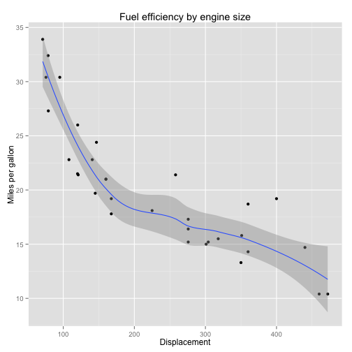
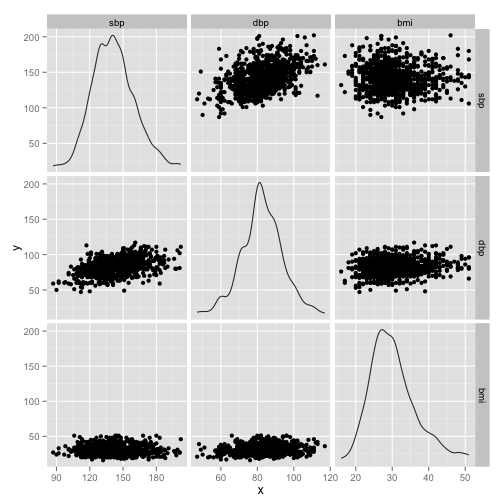

% Introduction to R
% Abhijit Dasgupta, PhD
  Data Community DC
% June 15, 2013

</img>
<br/>
<br/>

# Starting out in R

We will start off by creating a blank data.frame, opening a window to directly
enter data into it, do some manipulations, draw a plot, and generate a report
Some lines of code below are commented (line starting with `#`) so that it 
doesn't run during this document. If you want to run the code on your own,
just remove the `#` at the beginning of the lines.

R coding is free-form, in that you can split code over lines. If you want 
to put two commands on the same line of text, separate them with a `;`. 

I saved a version of R.df using the `save` command, into a file _example.rda_
You can replace it with the commented commands. Note that a R data file (an rda file)
will work for all versions of R on all platforms.


```r
load("example.rda")
# R.df <- data.frame() R.df <- fix(R.df) save(R.df, file='example.rda')
R.df
str(R.df)
library(reshape2)
R.df2 <- melt(R.df, id = "ID")
R.df2
str(R.df2)
table(R.df2$value)
barplot(table(R.df2$value))
```

 

```r
library(knitr)
library(pander)
# knit('Example1.Rmd'); Pandoc.convert('Example1.md', format='docx')
```


## Reading data into R from a CSV file

The most common type of data are text files, and often comma-separated
files or csv files. R natively handles the import of data in csv format, using 
`read.csv`.


```r
pheno <- read.csv("data/pheno.csv")
pheno  # This prints out the data
head(pheno)  # This prints out first 6 lines
tail(pheno)  # This prints out last 6 lines
```


> __Tip:__ you can just type an R object to see what it is or what it
> contains. For example, if you want to see how the function `read.csv` is 
> coded, just type `read.csv`. You can also find out just what the arguments for
> a function and their default values are using the function `arg`, as below


```r
read.csv
```

```
## function (file, header = TRUE, sep = ",", quote = "\"", dec = ".", 
##     fill = TRUE, comment.char = "", ...) 
## read.table(file = file, header = header, sep = sep, quote = quote, 
##     dec = dec, fill = fill, comment.char = comment.char, ...)
## <bytecode: 0x7f91c72aa150>
## <environment: namespace:utils>
```

```r
args(read.csv)
```

```
## function (file, header = TRUE, sep = ",", quote = "\"", dec = ".", 
##     fill = TRUE, comment.char = "", ...) 
## NULL
```


> We see that `read.csv` is build on the function 
> `read.table`. To see more about `read.table`, you can access its documentation
> by typing `?read.table` or `help(read.table)`


```r
help(read.table)
```


## Working with data sets

### Figuring out what's in a data set

R has two powerful functions which give you a quick feel about a data set. The 
two major pieces of information you need are

+ What kinds of data are part of the data set (use `str`)
+ Some summary of the data (use `summary`)

`str(pheno)` tells us that we have a `data.frame` object with 1000 observations
of 6 variables. Each variable has a type -- in this case all are integer variables (`int`)
and `sex` is a `factor` variable. I'll describe `factor` variables in a bit.

`summary(pheno)` gives numerical summaries for `int` variables (as it would for `numeric` variables)
and frequency tabulations for `factor` variables. If you have a `character` variable (denoted `chr` in the output of `str`), it would merely say that you have a character variable of 1000 observations


```r
str(pheno)
```

```
## 'data.frame':	1000 obs. of  6 variables:
##  $ X  : int  486 79 511 304 933 47 584 585 589 659 ...
##  $ sex: Factor w/ 2 levels "FEMALE","MALE": 2 1 1 2 2 1 1 1 1 1 ...
##  $ sbp: int  132 122 173 151 148 159 149 145 158 153 ...
##  $ dbp: int  76 60 63 81 89 79 90 100 80 68 ...
##  $ bmi: int  16 17 17 18 18 19 19 19 19 19 ...
##  $ id : int  45516 21869 24512 32125 21503 30728 49088 43523 41446 28797 ...
```

```r
summary(pheno)
```

```
##        X            sex           sbp           dbp             bmi      
##  Min.   :   1   FEMALE:468   Min.   : 87   Min.   : 47.0   Min.   :16.0  
##  1st Qu.: 251   MALE  :532   1st Qu.:129   1st Qu.: 76.0   1st Qu.:26.0  
##  Median : 500                Median :140   Median : 82.0   Median :29.0  
##  Mean   : 500                Mean   :141   Mean   : 82.6   Mean   :30.3  
##  3rd Qu.: 750                3rd Qu.:152   3rd Qu.: 90.0   3rd Qu.:33.0  
##  Max.   :1000                Max.   :202   Max.   :117.0   Max.   :51.0  
##                                                            NA's   :1     
##        id       
##  Min.   :10100  
##  1st Qu.:20168  
##  Median :28914  
##  Mean   :29713  
##  3rd Qu.:39570  
##  Max.   :49911  
## 
```


### A note on `data.frame`
The `data.frame` looks like a matrix, but it really isn't. This is one of the pitfalls
and quirks of R. We can see this by


```r
is.data.frame(pheno)
```

```
## [1] TRUE
```

```r
is.matrix(pheno)
```

```
## [1] FALSE
```


The `data.frame` object is really another kind of R object, a `list`. We will see later how 
this is useful, since R has very powerful list manipulation functions. Still, some matrix
operations are allowed for `data.frame` objects. For example, you can extract rows and columns and 
elements just like a matrix, using `pheno[1,]` (1st row), `pheno[,3]` (3rd column) or 
`pheno[1,2]` (the (1,2) element). 

You can extract variables (stored apparently in columns) either by the above matrix notation,
or by variable name. For example, to just extract the `sex` variable, you can use
`pheno$sex` or `pheno[,'sex']`. The `$` notation is useful to extract single variables,
but the matrix-like notation is useful to extract multiple variables by name: 
`pheno[,c('sex','sbp','dbp','bmi')]. As a side note,  `c()` is a function called "concatenate", which
creates vectors.

### Merging data sets

The study I took the data from has two files, geno and pheno, which
collected gene data and clinical data respectively from 1000 subjects. We
now read in the gene data, but we need to match up the two data sets so that
the rows correspond. The simplest way to do this is to sort the rows of the 
data frame by the `id` variable, so both have the same order. The data set `pheno` 
is already sorted. We need to do this for `pheno`. We will use the `order` function
on the `id` variable to figure out its sort order. Basically, the rule is that,
to sort a vector `x`, you can do `sort(x)` or `x[order(x)]`. Here what we need
is the correct re-ordering, not just the sorted values. So `order(x)` is what's needed
to re-order the rows. 

> __A general practice:__ Never change data (be it a vector or a data.frame) in place.
> Always copy it to differently-named object and change that. That way, if you 
> goof up, you're not having to re-generate everything. So, I saved the
> re-ordered `pheno` to `pheno2`. This keeps `pheno` unchanged.


```r
geno <- read.table("data/geno.csv", sep = ",", header = T)
head(geno)
```

```
##   snp1 snp2 snp3 snp4 snp5 snp6 snp7 snp8 snp9 snp10 snp11    id
## 1   CC   TT   TT   TT   CC   AG   TT   CC   TT    CT    TT 10100
## 2   TT   TT   CC   CC   CC   AA   AT   CT   CT    CC    TT 10110
## 3   CT   AT   TC   TT <NA>   AG   AT   CC   TT    CT    TT 10177
## 4   CT   TT   CC   CC   CC   AA   AT   CC   TT    CT    CT 10180
## 5   TT   TT   CC   CC   CC   AA   TT   CC   TT    CT    TT 10244
## 6   CT   AT <NA>   CT   CT   AG   AT   CT   CT    CC    CT 10245
```

```r
head(pheno)
```

```
##     X    sex sbp dbp bmi    id
## 1 486   MALE 132  76  16 45516
## 2  79 FEMALE 122  60  17 21869
## 3 511 FEMALE 173  63  17 24512
## 4 304   MALE 151  81  18 32125
## 5 933   MALE 148  89  18 21503
## 6  47 FEMALE 159  79  19 30728
```

```r
o = order(pheno$id)
# pheno$id[o]
pheno2 = pheno[o, ]
# pheno2 <- pheno[order(pheno$id),]
head(pheno2)
```

```
##       X    sex sbp dbp bmi    id
## 193 479   MALE 152  88  25 10100
## 621 711 FEMALE 187  88  31 10110
## 578 987   MALE 135  93  30 10177
## 80  110 FEMALE 148  92  23 10180
## 271 712 FEMALE 133  69  26 10244
## 33  472 FEMALE 112  47  21 10245
```


A better way to match the ordering of two data sets based on a common variable is to
use the function `match`


```r
args(match)
```

```
## function (x, table, nomatch = NA_integer_, incomparables = NULL) 
## NULL
```

```r
ind <- match(geno$id, pheno$id)
pheno3 <- pheno[ind, ]
```


You can check for yourself whether `pheno2` and `pheno3` are the same.

You can also merge the two datasets into a single data set based on a 
common variable, using the function `merge`. This does not require the common
variable (in this case, `id`) to be sorted, unlike in SAS.


```r
combined.data <- merge(pheno, geno, by = "id")
head(combined.data)
```

```
##      id   X    sex sbp dbp bmi snp1 snp2 snp3 snp4 snp5 snp6 snp7 snp8
## 1 10100 479   MALE 152  88  25   CC   TT   TT   TT   CC   AG   TT   CC
## 2 10110 711 FEMALE 187  88  31   TT   TT   CC   CC   CC   AA   AT   CT
## 3 10177 987   MALE 135  93  30   CT   AT   TC   TT <NA>   AG   AT   CC
## 4 10180 110 FEMALE 148  92  23   CT   TT   CC   CC   CC   AA   AT   CC
## 5 10244 712 FEMALE 133  69  26   TT   TT   CC   CC   CC   AA   TT   CC
## 6 10245 472 FEMALE 112  47  21   CT   AT <NA>   CT   CT   AG   AT   CT
##   snp9 snp10 snp11
## 1   TT    CT    TT
## 2   CT    CC    TT
## 3   TT    CT    TT
## 4   TT    CT    CT
## 5   TT    CT    TT
## 6   CT    CC    CT
```


### Factor variables

Factor variables are very useful, but can be quirky. Factors look like character
variables, but are really stored as numeric variables. They are meant to 
store categorical variables rather than strings. 


```r
s2 = as.character(pheno$sex)
str(s2)
```

```
##  chr [1:1000] "MALE" "FEMALE" "FEMALE" "MALE" "MALE" ...
```

```r
summary(s2)
```

```
##    Length     Class      Mode 
##      1000 character character
```

```r
head(as.numeric(pheno$sex))
```

```
## [1] 2 1 1 2 2 1
```

```r
head(as.numeric(s2))
```

```
## Warning: NAs introduced by coercion
```

```
## [1] NA NA NA NA NA NA
```


When we read in data sets, R, by default, converts any string variable to a factor. This is 
often not what we want. For example, an identifier variable needs to remain a character, 
not a factor. Most of us suggest making sure that strings are imported as characters, not 
factors. There is an option `stringsAsFactors` which can be set globally using 
`options(stringsAsFactors=FALSE)`. You can also set it on the fly when you import data


```r
pheno <- read.csv("data/pheno.csv", stringsAsFactors = F)
```


You can also pre-specify what the types of variables are in each column you 
are importing, using the option `colClasses` (note the camel-case). This 
is much faster if you are importing large data sets


```r
pheno <- read.csv("data/pheno.csv", colClasses = c("integer", "factor", "integer", 
    "integer", "integer", "integer"))
```


## Reading from databases

R has packages to import data from most standard relational databases. The
generic package is `RODBC` which connects R to ODBC-compliant databases. Popular
databases also have dedicated packages, including 

+ MySQL (`RMySQL`),
+ Postgresql (`RPgSQL`),
+ SQLite (`RSQLite`), 
+ MonetDB (`MonetDB.R`)

More recently, there are packages to import from 
MongoDB and CouchDB, two popular NoSQL databases.

I'm demonstrating using RSQLite, since it installs the sqlite database automatically.
The other package you need is `sqldb`, which allows you to manipulate R data frames and
database objects using SQL commands. If you are coming from a SQL background, 
this is a life saver.


```r
library(RSQLite)
sqlite <- dbDriver("SQLite")
exampledb <- dbConnect(sqlite, "data/mydb.sqlite")
dbListTables(exampledb)
```

```
## [1] "genotype"  "phenotype"
```

```r
library(sqldf)
sqldf("select * from phenotype limit 5", dbname = "data/mydb.sqlite")
```

```
##     X    sex sbp dbp bmi    id
## 1 486   MALE 132  76  16 45516
## 2  79 FEMALE 122  60  17 21869
## 3 511 FEMALE 173  63  17 24512
## 4 304   MALE 151  81  18 32125
## 5 933   MALE 148  89  18 21503
```

```r
sqldf("select * from pheno limit 5")  # use the data.frame pheno
```

```
##     X    sex sbp dbp bmi    id
## 1 486   MALE 132  76  16 45516
## 2  79 FEMALE 122  60  17 21869
## 3 511 FEMALE 173  63  17 24512
## 4 304   MALE 151  81  18 32125
## 5 933   MALE 148  89  18 21503
```


## Subsetting

We will use another data set that comes with R to demonstrate some other functionalities.
You can see all the data sets that are loaded with R and other R packages you might 
have installed by typing `data()`. We will use the `mtcars` data set, which is 
a data set of car road tests published by Motor Trend magazine in 1974. 

First, we will look at subsetting data by values of some variable. Note, if you
wanted to subset particular rows, say the first 10 rows, you could just use matrix
notation and do `mtcars[1:10,]`. 

>> The notation `1:10` denotes the sequence 1,2,3,4,5,6,7,8,9,10, stored in a numeric
>> vector. This is similar to the function `range` in Python.

>> Note that R starts counting at 1, so the first element of a vector `x` is `x[1]`. This
>> is unlike Python or C, which start counting at 0. This is because of R's close history
>> with Fortran, which was a column-dominant language counting from 1. 

We start by extracting the subset of data where number of cylinders is 6. Note that
we are using `==` and not `=`. You can also put multiple conditions in your subset conditions, 
either using `&` (and) or `|` (or)


```r
str(mtcars)
```

```
## 'data.frame':	32 obs. of  11 variables:
##  $ mpg : num  21 21 22.8 21.4 18.7 18.1 14.3 24.4 22.8 19.2 ...
##  $ cyl : num  6 6 4 6 8 6 8 4 4 6 ...
##  $ disp: num  160 160 108 258 360 ...
##  $ hp  : num  110 110 93 110 175 105 245 62 95 123 ...
##  $ drat: num  3.9 3.9 3.85 3.08 3.15 2.76 3.21 3.69 3.92 3.92 ...
##  $ wt  : num  2.62 2.88 2.32 3.21 3.44 ...
##  $ qsec: num  16.5 17 18.6 19.4 17 ...
##  $ vs  : num  0 0 1 1 0 1 0 1 1 1 ...
##  $ am  : num  1 1 1 0 0 0 0 0 0 0 ...
##  $ gear: num  4 4 4 3 3 3 3 4 4 4 ...
##  $ carb: num  4 4 1 1 2 1 4 2 2 4 ...
```

```r
head(mtcars)
```

```
##                    mpg cyl disp  hp drat    wt  qsec vs am gear carb
## Mazda RX4         21.0   6  160 110 3.90 2.620 16.46  0  1    4    4
## Mazda RX4 Wag     21.0   6  160 110 3.90 2.875 17.02  0  1    4    4
## Datsun 710        22.8   4  108  93 3.85 2.320 18.61  1  1    4    1
## Hornet 4 Drive    21.4   6  258 110 3.08 3.215 19.44  1  0    3    1
## Hornet Sportabout 18.7   8  360 175 3.15 3.440 17.02  0  0    3    2
## Valiant           18.1   6  225 105 2.76 3.460 20.22  1  0    3    1
```

```r
subset(mtcars, cyl == 6)
```

```
##                 mpg cyl  disp  hp drat    wt  qsec vs am gear carb
## Mazda RX4      21.0   6 160.0 110 3.90 2.620 16.46  0  1    4    4
## Mazda RX4 Wag  21.0   6 160.0 110 3.90 2.875 17.02  0  1    4    4
## Hornet 4 Drive 21.4   6 258.0 110 3.08 3.215 19.44  1  0    3    1
## Valiant        18.1   6 225.0 105 2.76 3.460 20.22  1  0    3    1
## Merc 280       19.2   6 167.6 123 3.92 3.440 18.30  1  0    4    4
## Merc 280C      17.8   6 167.6 123 3.92 3.440 18.90  1  0    4    4
## Ferrari Dino   19.7   6 145.0 175 3.62 2.770 15.50  0  1    5    6
```

```r
subset(mtcars, cyl == 6 & mpg < 20)
```

```
##               mpg cyl  disp  hp drat   wt  qsec vs am gear carb
## Valiant      18.1   6 225.0 105 2.76 3.46 20.22  1  0    3    1
## Merc 280     19.2   6 167.6 123 3.92 3.44 18.30  1  0    4    4
## Merc 280C    17.8   6 167.6 123 3.92 3.44 18.90  1  0    4    4
## Ferrari Dino 19.7   6 145.0 175 3.62 2.77 15.50  0  1    5    6
```


## Transformation and creating new variables

The non-destructive way of creating new variables in a data set is the function `transform`. First
we want to say that if a car gets less than 20 mpg, it is a gas guzzler. R has a convenient
`ifelse` function to do this (much like th `?` function in Python/C). Ideally you want to make this new variable a factor.

You can create multiple variables in one command using `transform`. For example, I also
convert mpg to kmpg.


```r
ifelse(mtcars$mpg < 20, "gas.guzzler", "Econ")
```

```
##  [1] "Econ"        "Econ"        "Econ"        "Econ"        "gas.guzzler"
##  [6] "gas.guzzler" "gas.guzzler" "Econ"        "Econ"        "gas.guzzler"
## [11] "gas.guzzler" "gas.guzzler" "gas.guzzler" "gas.guzzler" "gas.guzzler"
## [16] "gas.guzzler" "gas.guzzler" "Econ"        "Econ"        "Econ"       
## [21] "Econ"        "gas.guzzler" "gas.guzzler" "gas.guzzler" "gas.guzzler"
## [26] "Econ"        "Econ"        "Econ"        "gas.guzzler" "gas.guzzler"
## [31] "gas.guzzler" "Econ"
```

```r
blah <- transform(mtcars, gas = ifelse(mpg < 20, "gas.guzzler", "econ"), kmpg = 1.6 * 
    mpg)
str(blah)
```

```
## 'data.frame':	32 obs. of  13 variables:
##  $ mpg : num  21 21 22.8 21.4 18.7 18.1 14.3 24.4 22.8 19.2 ...
##  $ cyl : num  6 6 4 6 8 6 8 4 4 6 ...
##  $ disp: num  160 160 108 258 360 ...
##  $ hp  : num  110 110 93 110 175 105 245 62 95 123 ...
##  $ drat: num  3.9 3.9 3.85 3.08 3.15 2.76 3.21 3.69 3.92 3.92 ...
##  $ wt  : num  2.62 2.88 2.32 3.21 3.44 ...
##  $ qsec: num  16.5 17 18.6 19.4 17 ...
##  $ vs  : num  0 0 1 1 0 1 0 1 1 1 ...
##  $ am  : num  1 1 1 0 0 0 0 0 0 0 ...
##  $ gear: num  4 4 4 3 3 3 3 4 4 4 ...
##  $ carb: num  4 4 1 1 2 1 4 2 2 4 ...
##  $ gas : Factor w/ 2 levels "econ","gas.guzzler": 1 1 1 1 2 2 2 1 1 2 ...
##  $ kmpg: num  33.6 33.6 36.5 34.2 29.9 ...
```

```r
blah <- transform(mtcars, gas = ifelse(mpg < 20, "gas.guzzler", "econ"), kmpg = 1.6 * 
    mpg, score = 3 * cyl + 0.1 * wt - 0.01 * mpg)
str(blah)
```

```
## 'data.frame':	32 obs. of  14 variables:
##  $ mpg  : num  21 21 22.8 21.4 18.7 18.1 14.3 24.4 22.8 19.2 ...
##  $ cyl  : num  6 6 4 6 8 6 8 4 4 6 ...
##  $ disp : num  160 160 108 258 360 ...
##  $ hp   : num  110 110 93 110 175 105 245 62 95 123 ...
##  $ drat : num  3.9 3.9 3.85 3.08 3.15 2.76 3.21 3.69 3.92 3.92 ...
##  $ wt   : num  2.62 2.88 2.32 3.21 3.44 ...
##  $ qsec : num  16.5 17 18.6 19.4 17 ...
##  $ vs   : num  0 0 1 1 0 1 0 1 1 1 ...
##  $ am   : num  1 1 1 0 0 0 0 0 0 0 ...
##  $ gear : num  4 4 4 3 3 3 3 4 4 4 ...
##  $ carb : num  4 4 1 1 2 1 4 2 2 4 ...
##  $ gas  : Factor w/ 2 levels "econ","gas.guzzler": 1 1 1 1 2 2 2 1 1 2 ...
##  $ kmpg : num  33.6 33.6 36.5 34.2 29.9 ...
##  $ score: num  18.1 18.1 12 18.1 24.2 ...
```


Note that the original `mtcars` remains unchanged


```r
str(mtcars)
```

```
## 'data.frame':	32 obs. of  11 variables:
##  $ mpg : num  21 21 22.8 21.4 18.7 18.1 14.3 24.4 22.8 19.2 ...
##  $ cyl : num  6 6 4 6 8 6 8 4 4 6 ...
##  $ disp: num  160 160 108 258 360 ...
##  $ hp  : num  110 110 93 110 175 105 245 62 95 123 ...
##  $ drat: num  3.9 3.9 3.85 3.08 3.15 2.76 3.21 3.69 3.92 3.92 ...
##  $ wt  : num  2.62 2.88 2.32 3.21 3.44 ...
##  $ qsec: num  16.5 17 18.6 19.4 17 ...
##  $ vs  : num  0 0 1 1 0 1 0 1 1 1 ...
##  $ am  : num  1 1 1 0 0 0 0 0 0 0 ...
##  $ gear: num  4 4 4 3 3 3 3 4 4 4 ...
##  $ carb: num  4 4 1 1 2 1 4 2 2 4 ...
```


## Missing data
R codes missing data as `NA`, and provides the function `is.na` to find missing values. 
Many of R's functions give a missing value or `NA` if one of the components in the computation is missing. 
This behavior can be suppressed within the functions which accept it by the option `na.rm=TRUE`. The
`summary` function we saw before already does this, and tells you how many values are missing for
each variable in the data set


```r
blah$mpg[3] <- NA
head(blah)
```

```
##                    mpg cyl disp  hp drat    wt  qsec vs am gear carb
## Mazda RX4         21.0   6  160 110 3.90 2.620 16.46  0  1    4    4
## Mazda RX4 Wag     21.0   6  160 110 3.90 2.875 17.02  0  1    4    4
## Datsun 710          NA   4  108  93 3.85 2.320 18.61  1  1    4    1
## Hornet 4 Drive    21.4   6  258 110 3.08 3.215 19.44  1  0    3    1
## Hornet Sportabout 18.7   8  360 175 3.15 3.440 17.02  0  0    3    2
## Valiant           18.1   6  225 105 2.76 3.460 20.22  1  0    3    1
##                           gas  kmpg score
## Mazda RX4                econ 33.60 18.05
## Mazda RX4 Wag            econ 33.60 18.08
## Datsun 710               econ 36.48 12.00
## Hornet 4 Drive           econ 34.24 18.11
## Hornet Sportabout gas.guzzler 29.92 24.16
## Valiant           gas.guzzler 28.96 18.16
```

```r
mean(blah$mpg)
```

```
## [1] NA
```

```r
mean(blah$mpg, na.rm = T)
```

```
## [1] 20
```


## 'Apply'ing a function over components of a data set
R provides a family of functions, all ending in `apply`, which are meant to 
evaluate a function over different aspects of a data set. The function `apply` works on matrices.


```r
args(apply)
# X = matrix(rnorm(100),ncol=10) # rnorm generates normal random numbers
# apply(X, 2, mean)
```


`lapply` does the same for components of a `list`. Recall I said that a `data.frame` object
is really a `list`. So the following works:


```r
args(lapply)
# lapply(pheno, mean, na.rm=T)
```


## Aggregation

R provides many ways to aggregate data, including the functions `by` and `aggregate`. The most
powerful group of functions are from the package `plyr`. These functions are all of
the form `(x)(y)ply`, where `(x)` and `(y)` can be any of _d_ (data.frame),_a_ (array), and
_l_ (list). `(x)` denotes the type of data that is input, and `(y)` denotes the type of data 
being output. These functions implement what Wickham calls the "split-apply-combine" paradigm, 
i.e., you split the data by some variable (usually of type `factor`), apply a function to the split pieces, and put
the results of the functions back together. The documentation is rather unfortunate for these 
functions, so I'll demonstrate by example.

We will first look at the average mpg of the cars in `mtcars` by number of cylinders. This 
can be done by splitting the data set by `cyl`, passing the split data sets through the function
`summarise`, and then putting the results back together into a data frame. For more information on
the `summarise` function, look at its documentation. There are two ways of denoting the splitting
variable. I prefer `~cyl`, since it is similar to the formula interface for modeling in R that I
am familiar with, and that you will learn later. You can also split on two or more factors quite
easily. With `summarise`, you can also compute more than one measure


```r
library(plyr)
mtcars <- transform(mtcars, cyl = as.factor(cyl), gear = as.factor(gear))  #this creates a local copy
avg.by.cyl <- ddply(mtcars, ~cyl, summarise, mpg = mean(mpg, na.rm = T))
# avg.by.cyl <- ddply(mtcars, .(cyl), summarise, mpg = mean(mpg, na.rm=T))
avg.by.cyl
```

```
##   cyl   mpg
## 1   4 26.66
## 2   6 19.74
## 3   8 15.10
```

```r
avg.by.cyl.gear <- ddply(mtcars, ~cyl + gear, summarise, mean.mpg = mean(mpg, 
    na.rm = T), median.mpg = median(mpg, na.rm = T))
avg.by.cyl.gear
```

```
##   cyl gear mean.mpg median.mpg
## 1   4    3    21.50      21.50
## 2   4    4    26.93      25.85
## 3   4    5    28.20      28.20
## 4   6    3    19.75      19.75
## 5   6    4    19.75      20.10
## 6   6    5    19.70      19.70
## 7   8    3    15.05      15.20
## 8   8    5    15.40      15.40
```


If you want to just split the data set up by a variable, that is very easy as well


```r
dlply(mtcars, ~cyl)
```


# Basic plotting
R provides several plotting frameworks. The basic one is known as base graphics, and 
one of the more popular frameworks is in the package [`ggplot2`](http://docs.ggplot2.org).
To make a few quick and dirty plots....


```r
plot(mpg ~ disp, data = mtcars)
```

 

```r
plot(mpg ~ disp, data = mtcars, xlab = "Displacement", ylab = "Miles per gallon", 
    main = "Fuel effiency by engine size")  # adding labels
```

 

```r
boxplot(mpg ~ cyl, data = mtcars)
```

 


You can make prettier plots with better defaults using `ggplot2` which is based on the 
Grammar of Graphics. The idea is, like a painter, to layer different components of the plot
on top of each other. The syntax is quirky again, but once you learn it, it is really
very powerful. 


```r
library(ggplot2)
print(ggplot(mtcars, aes(x = disp, y = mpg)) + geom_point())
```

 

```r
print(ggplot(mtcars, aes(x = disp, y = mpg)) + geom_point() + geom_smooth() + 
    labs(x = "Displacement", y = "Miles per gallon") + ggtitle("Fuel efficiency by engine size"))
```

 

```r
print(ggplot(mtcars, aes(x = disp, y = mpg)) + geom_point() + geom_smooth() + 
    facet_wrap(~cyl, ncol = 1) + labs(x = "Displacement", y = "Miles per gallon"))
```

 


If you want to look at several variables and their inter-relationships, the functions
`pairs` (base graphics) and `plotmatrix` (ggplot2) work


```r
pairs(pheno[, c("sbp", "dbp", "bmi")])
```

 

```r
print(plotmatrix(pheno[, c("sbp", "dbp", "bmi")]))
```

```
## This function is deprecated. For a replacement, see the ggpairs function
## in the GGally package. (Deprecated; last used in version 0.9.2)
```

 


### Javascript-based interactive charts
I believe the future is in web-based content-rich interactive charts. The package
`rCharts` provides an interface from R to several Javascript graphing libraries. Running the following
code will open up your web browser to display the charts. These charts can be integrated into HTML
documents, but that's another day. See the [rCharts](http://ramnathv.github.io/rCharts/) webpage
for more details.


```r
library(rCharts)
r1 <- rPlot(mpg ~ wt | cyl, data = mtcars, type = "point")
r1
```


# Some basic modeling
Fitting a linear regression model to two variables is a pretty basic task. R
provies an intuitive formula interface for all its modeling functions, which 
reads just like an equation. The linear regression model is fit using the function
`lm` (linear model). Other modeling functions include `glm` (generalized linear models),
`lrm` (logistic regression, in package rms), `coxph` (Cox regression, in package survival),
and several machine learning methods in the package `caret`. There are many more.

>> __Huge tip:__ Go to the [Task Views](http://cran.rstudio.com/web/views/) page on 
>> CRAN to find packages addressing different
>> topics in analytics


```r
model1 <- lm(mpg ~ disp, data = mtcars)
model1
```

```
## 
## Call:
## lm(formula = mpg ~ disp, data = mtcars)
## 
## Coefficients:
## (Intercept)         disp  
##     29.5999      -0.0412
```

```r
summary(model1)
```

```
## 
## Call:
## lm(formula = mpg ~ disp, data = mtcars)
## 
## Residuals:
##    Min     1Q Median     3Q    Max 
## -4.892 -2.202 -0.963  1.627  7.231 
## 
## Coefficients:
##             Estimate Std. Error t value Pr(>|t|)    
## (Intercept) 29.59985    1.22972   24.07  < 2e-16 ***
## disp        -0.04122    0.00471   -8.75  9.4e-10 ***
## ---
## Signif. codes:  0 '***' 0.001 '**' 0.01 '*' 0.05 '.' 0.1 ' ' 1
## 
## Residual standard error: 3.25 on 30 degrees of freedom
## Multiple R-squared:  0.718,	Adjusted R-squared:  0.709 
## F-statistic: 76.5 on 1 and 30 DF,  p-value: 9.38e-10
```


You can now export components of the results for use in your report. The most useful
tools (in Windows) is the package `R2wd` which will take the result of the model, 
format it and put it into your open Word document. 

My preferred way now is using [markdown](http://daringfireball.net/projects/markdown/),
[pandoc](http://johnmacfarlane.net/pandoc/) and the R package [knitr](http://yihui.name/knitr/),
as demonstrated [here](http://yihui.name/knitr/demo/pandoc/). `knitr` is a very powerful tool
which is relatively easy to use (I'm using it right now), so is worth a look. This file uses these tools,
and the process of converting it to Word and HTML are described at the end of this document. The 
results of the model above is formatted below:


```r
require(pander)
pander(model1)
```


--------------------------------------------------------------
     &nbsp;        Estimate   Std. Error   t value   Pr(>|t|) 
----------------- ---------- ------------ --------- ----------
 **(Intercept)**     29.6        1.23       24.07   3.577e-21 

    **disp**       -0.04122    0.004712    -8.747    9.38e-10 
--------------------------------------------------------------

Table: Fitting linear model: mpg ~ disp


R treats graphs as printable objects, and so provides several "printers" to convert
graphs to PDF, PNG, JPG, etc. 


```r
dev.off()
pdf(file = "graph.pdf")
# png(file='graph.png') jpeg(file='graph.jpg')
plot(mpg ~ disp, data = mtcars, xlab = "Displacement", ylab = "Miles per gallon")
dev.off()
```


### Finally
You should be writing R in a script file and passing it to R, rather than writing 
directly in the R console. However, R automatically saves all your commands in a history file, so 
you can save that directly


```r
savehistory("~/Downloads/workshop-master/WorkshopHistory.R")
```


# Resources
No endorsement is implied in this list. There are many many R resources out 
there. This is the tip of the iceberg.

## Learning R

1. [Learning R](http://learnr.workpress.com)
2. [UCLA IDRE](http://www.ats.ucla.edu/stat/r/)
3. [R Bloggers](http://www.r-bloggers.com)
4. [CRAN Task Views](http://cran.r-project.org/web/views)
5. [Code school](http://www.codeschool.com/courses/try-r)
6. [How to learn R](http://www.inside-r.org/howto/how-learn-r)
7. [A R mindmap](http://www.xmind.net/m/LKF2/)
8. [statistics.com](http://www.statistics.com)

## Coming from another software

1. [SAS and R](http://sas-and-r.blogspot.com)
2. [r4stats](http://r4stats.com/examples/)
3. [RExcel](http://rcom.univie.ac.at)

## Locally (shameless plug)

1. [Statistical Programming DC](http://datacommunitydc.org/blog/stats-prog-dc/)
2. [Data Science DC](http://datacommunitydc.org/blog/data-science-dc/)
3. [Data Visualization DC](http://datacommunitydc.org/blog/data-visualization-dc/)

# Acknowledgements

I would like to thank Tony Ojeda for organizing the workshop, the participants for their questions
and interaction, and authors of the R packages I use. 

This document is written within RStudio using the R Notebook facility. The source _WorkshopHistory.R_
is formatted in accordance with requirements of the `spin` function of the `knitr` package, which 
converted this to Rmarkdown (_WorkshopHistory.Rmd_) and Markdown (_WorkshopHistory.md_). This
was then converted to HTML (_WorkshopHistory.md.html_) and Word (_WorkshopHistory.md.docx_) using 
[pandoc](http://johnmacfarlane.net/pandoc/) and the function `Pandoc.convert` from the R package
_pander_. The code has been extracted into a separate file _code.R_. 
This document contains both the text and the R code and can be reproduced locally by
the commands


```r
library(knitr)
library(pander)
spin("WorkshopHistory.R")
Pandoc.convert("WorkshopHistory.md", format = "docx")
Pandoc.convert("WorkshopHistory.md", format = "html")
```


The R code can be extracted following the previous commands, using the commands


```r
library(knitr)
purl("WorkshopHistory.Rmd", output = "code.R")
```


I hope you have fun exploring R and the many tools it provides for data analytics.


-------
This report was generated with [R](http://www.r-project.org/) (3.0.1) and [pander](https://github.com/rapporter/pander) (0.3.7) on x86_64-apple-darwin10.8.0 platform.
